# 📸 Amazon Ads AI Optimization

The live environment runs against ClickHouse Cloud and the Anthropic API, so it's kept private to avoid open cloud billing exposure. This tour walks through the UI, the two-layer analysis pipeline, and the underlying data architecture using screenshots from the actual running system.

> All campaign data is seeded mock data. No real Amazon accounts or ad spend involved.

---

## How It Works

Analysis runs in two layers, connected only at the API route.

**Layer 1 — Rules Engine:** Pure TypeScript, no AI involved. Applies each client's configured ACOS thresholds to every keyword and returns a flag. First matching rule wins.

| Flag | Condition |
|---|---|
| `insufficient_data` | Clicks below minimum (default 20) |
| `zero_sales` | Enough clicks, zero conversions |
| `pause_candidate` | ACOS > 3× target |
| `reduce_25` | ACOS > 2× target |
| `reduce_15` | ACOS > 1.5× target |
| `underinvested` | ACOS < 0.7× target with sufficient clicks |
| `healthy` | None of the above |

**Layer 2 — AI Agent:** Runs on flagged keywords only. Two Claude Sonnet calls in sequence:

- **Call 1 — `evaluate-context-override`:** For each flagged keyword, the model produces a decision (`ACT` / `HOLD` / `ESCALATE`), a one-line brief, full reasoning, and a confidence score. In Scenario Mode, the agent reasons against an injected business context string before deciding.
- **Call 2 — `generate-campaign-recommendation`:** Aggregates all per-keyword decisions into a final campaign recommendation with new bid values and an overall confidence score (weakest-link of all Call 1 scores).

> The AI pipeline layer is built on the same architecture as the [Atom Process Engine](../atom-process-engine) — three-layer separation, markdown-driven step definitions, schema validation at each boundary, and immutable audit logging.

---

## Analysis Modes

| Mode | Scenario Context | Agent Behavior |
|---|---|---|
| **Normal** | None | Evaluates on keyword metrics and `is_main_keyword` flag only |
| **Scenario** | Injected from `ads_campaigns.scenario_text` | Reasons against current business conditions before deciding ACT vs HOLD |

The core point the demo illustrates: switching modes changes only the input — the same atoms, same process, same infrastructure produce different decisions when context is present.

---

## Demo Clients

Five fictional clients with seeded campaign data, each representing a distinct real-world condition:

| Client | Category | Scenario |
|---|---|---|
| Lumiere Jewelry | Jewelry | Mother's Day seasonality, CPCs trending up |
| Aqua Fun | Pool & Outdoor | Peak summer, inventory pressure |
| Homecraft Kitchen | Kitchen | Post-launch mode, elevated ACOS target |
| Nestwell Home | Home & Bedding | Q4 holiday ramp |
| HydroLife | Fitness | Post-price-change instability |

---

## Data Architecture

Two stores, separated by access pattern.

**Supabase (PostgreSQL)** — transactional layer for active campaign data. Client config, live keywords, atom definitions, task state, and analysis run history. Powers real-time UI updates via Supabase Realtime.

**ClickHouse Cloud** — analytical layer for inactive keyword history. ~1,200 archived rows per client, built for timeframe-filtered scans (1m / 3m / 6m / 12m) and aggregation queries like lifetime spend and top pause reasons.

The Active / Inactive toggle on the keyword table surfaces this split directly — the source badge updates with the view (● Supabase ↔ ● ClickHouse). AI analysis is intentionally disabled in the inactive view; archive data is for retrospective analytics, not live decisioning.

---

## 🗺️ Screenshot

- [Section 1: Dashboard & Workspace](#-section-1-dashboard--workspace)
- [Section 2: Two-Layer Analysis Pipeline — Normal Mode](#-section-2-two-layer-analysis-pipeline--normal-mode)
- [Section 3: Two-Layer Analysis Pipeline — Scenario Mode](#-section-3-two-layer-analysis-pipeline--scenario-mode)
- [Section 4: Inactive Keywords & Historical Analytics (ClickHouse)](#-section-4-inactive-keywords--historical-analytics-clickhouse)
- [Section 5: AI Product Listing Analysis](#-section-5-ai-product-listing-analysis)
- [Section 6: AI Analysis History & Logs](#-section-6-ai-analysis-history--logs)
- [Section 7: Under the Hood — Rules Engine & Process Inspector](#-section-7-under-the-hood--rules-engine--process-inspector)

---

## 📊 Section 1: Dashboard & Workspace

Five demo clients are pre-loaded, each with their own campaign config, ACOS targets, and scenario context stored in Supabase. Selecting a client from the dropdown loads their campaign profile and populates the keyword workspace.

👁️ View Screenshots (3 images)

### Landing Page — Client Selection
The entry point where a demo client is selected. Each client has distinct campaign settings and keyword data seeded in Supabase — switching clients reloads the full workspace with that client's data.

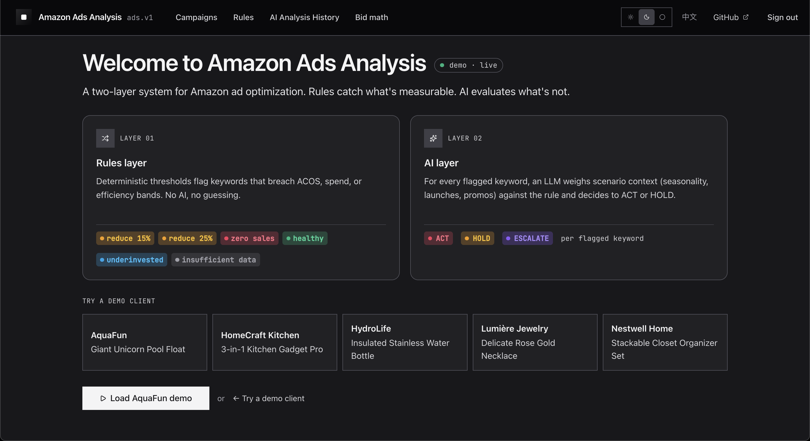

### Active Keyword Workspace (Dark Mode)
The main workspace showing live keyword metrics from Supabase. From here you can filter keywords, trigger an analysis run, and review rule flags and AI decisions side by side.

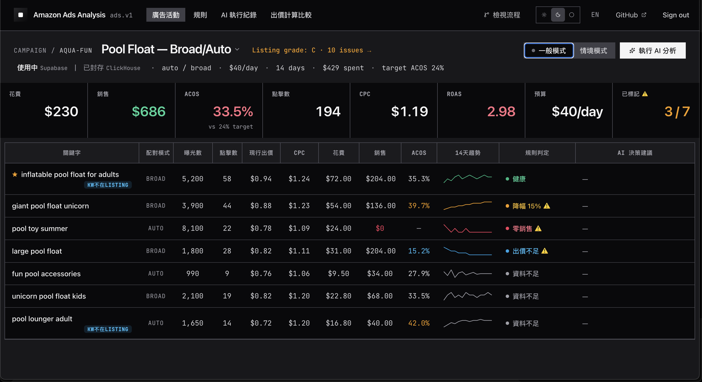

### Active Keyword Workspace (Light Mode)
The same workspace in light mode. Theme preference persists across the session.

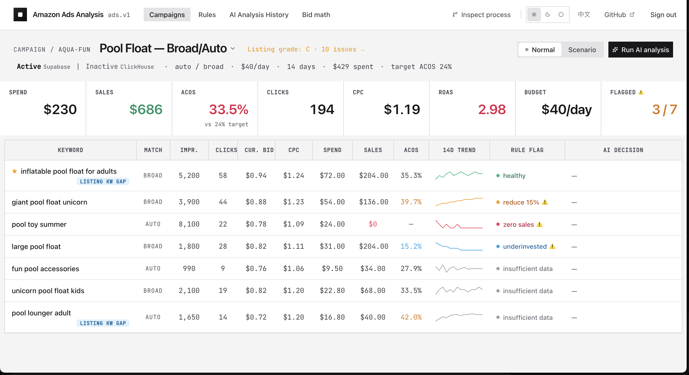

[↑ Back to top](#-tour-navigation)

---

## 🧠 Section 2: Two-Layer Analysis Pipeline — Normal Mode

Analysis runs in two sequential layers, connected only at the API route.

**Layer 1 — Rules Engine:** Pure TypeScript, no AI involved. Applies each client's configured ACOS thresholds to every keyword and returns a flag (`pause_candidate`, `reduce_25`, `underinvested`, etc.). First matching rule wins.

**Layer 2 — AI Agent:** Runs on flagged keywords only. Two Claude Sonnet calls in sequence — Call 1 evaluates each flagged keyword individually (`ACT` / `HOLD` / `ESCALATE`), Call 2 aggregates all decisions into a final campaign recommendation with updated bid values. In Normal Mode, the model reasons purely on keyword metrics with no external context injected.

👁️ View Screenshots (4 images)

### LLM Call 1 — In Progress
The UI tracking the first AI call as it processes each flagged keyword in real time, producing per-keyword ACT/HOLD/ESCALATE decisions before Call 2 picks them up.

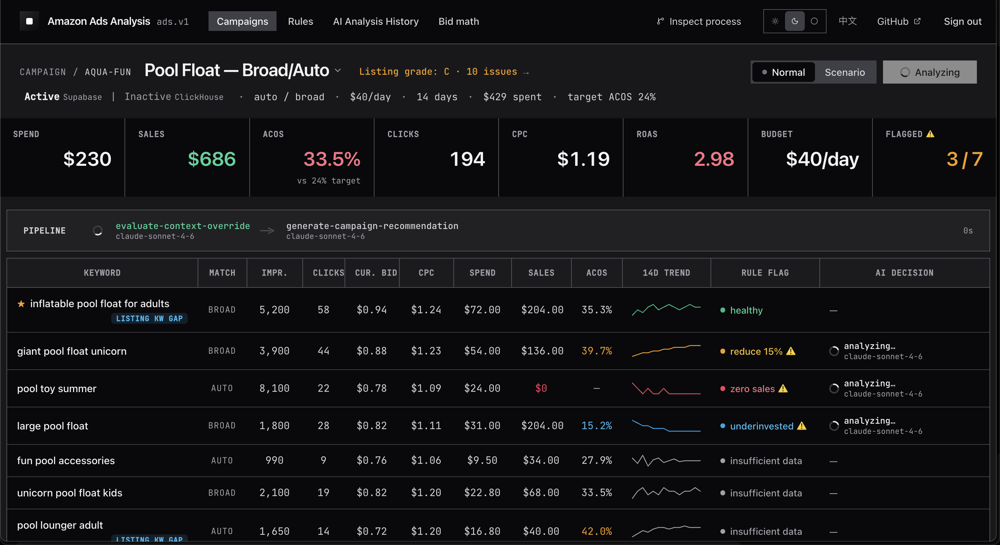

### LLM Call 2 — In Progress
The second AI call running downstream, aggregating all per-keyword decisions into the final campaign-level recommendation.

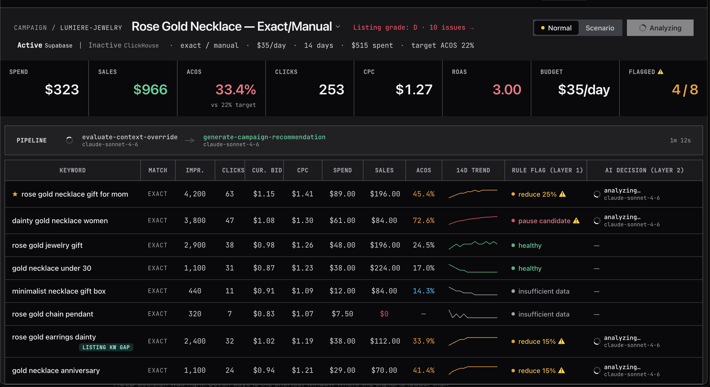

### Analysis Output — Campaign Recommendation
The completed output: new bid values per keyword, overall confidence score, and the campaign-level summary from Call 2.

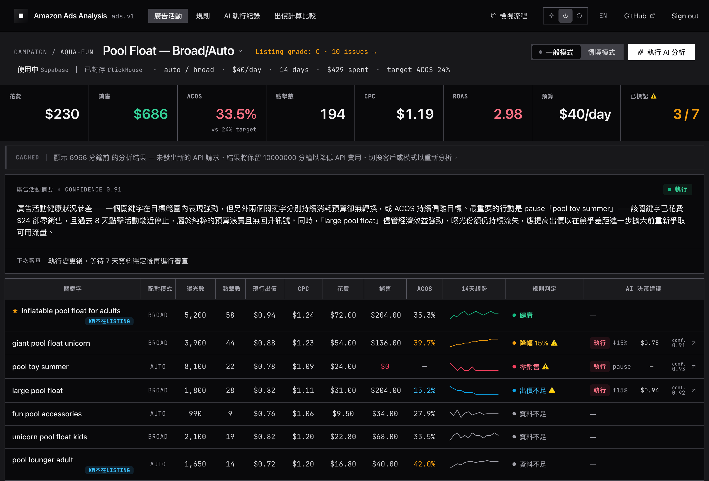

### Result Detail — Per-Keyword Reasoning
Drilling into a specific keyword to see the full Call 1 output: the rule flag that triggered analysis, the ACT/HOLD/ESCALATE decision, the model's reasoning, and the confidence score.

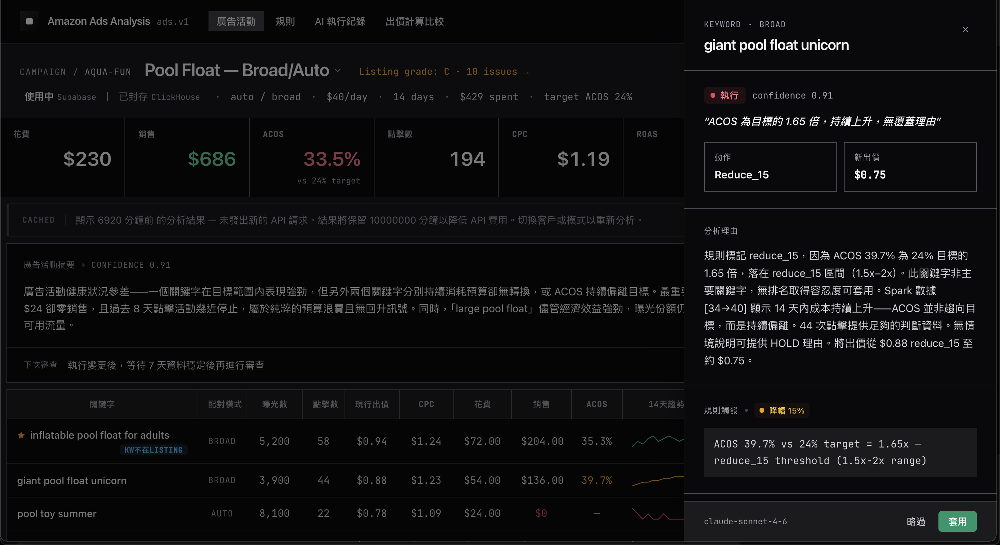

[↑ Back to top](#-tour-navigation)

---

## 🔄 Section 3: Two-Layer Analysis Pipeline — Scenario Mode

Scenario Mode injects an external context string into the first LLM call before the run. The context is a plain-text field stored in Supabase per client (e.g. *"Mother's Day 7 days away, CPCs trending +40%"*). The pipeline structure, AI calls, and infrastructure are unchanged — only the prompt input differs. The model reasons against the injected business context before deciding whether to ACT or HOLD on a rule flag.

This is the core point the demo illustrates: the same two-layer pipeline produces meaningfully different decisions when context changes, without any changes to the underlying code or agent structure.

👁️ View Screenshots (2 images)

### Scenario Mode — Active Context Injection
The workspace under Scenario Mode, with the active scenario string visible in the UI. Everything else — the keyword table, analysis controls, and pipeline — is identical to Normal Mode.

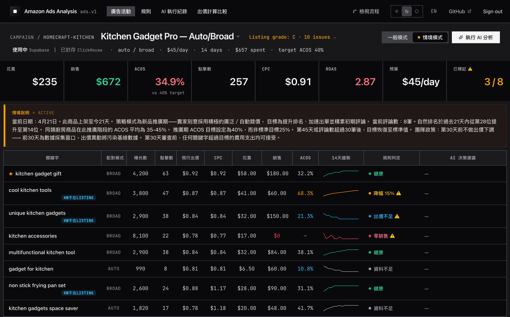

### Keyword Table — Post-Analysis State (Scenario Mode)
The keyword table after a Scenario Mode run, with rule flags and AI decisions visible inline for each row. Compare with Normal Mode results to see how injected context shifts ACT/HOLD decisions.

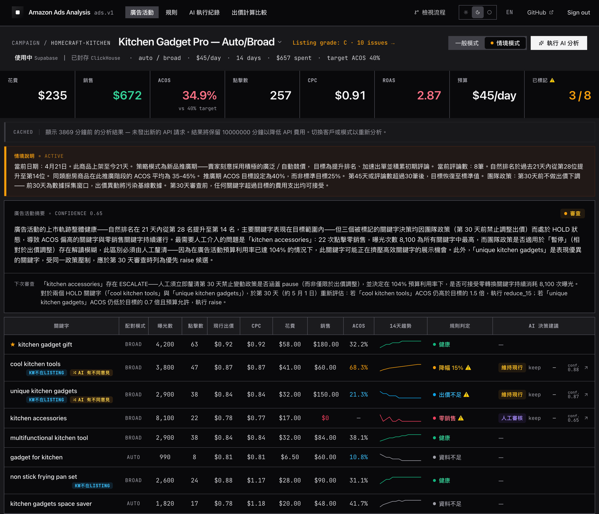

[↑ Back to top](#-tour-navigation)

---

## 💾 Section 4: Inactive Keywords & Historical Analytics (ClickHouse)

The Active / Inactive toggle on the keyword table switches the underlying data source. Active keywords come from Supabase (transactional, row-level). Inactive keywords are served from ClickHouse Cloud — ~1,200 archived rows per client, built for timeframe-filtered scans (1m / 3m / 6m / 12m) and aggregation queries like lifetime spend and top pause reasons.

The source badge in the UI updates with the view (● Supabase → ● ClickHouse). AI analysis is intentionally disabled in the inactive view — historical data is for retrospective review only.

👁️ View Screenshots (3 images)

### Inactive Keywords — ClickHouse Table View
The keyword table reading from ClickHouse, with timeframe filters active. The source badge reflects the switch away from Supabase.

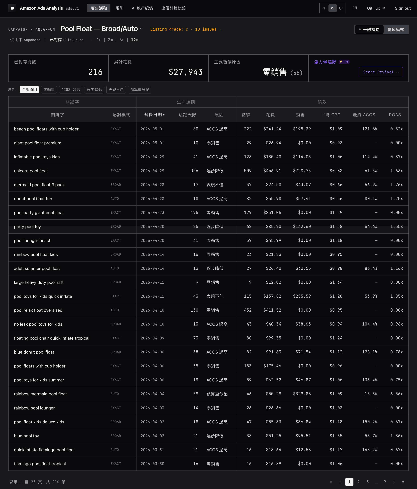

### Inactive Keywords — Normal Mode (Revive Panel)
Reviewing archived keywords under standard rule configurations to identify revive candidates.

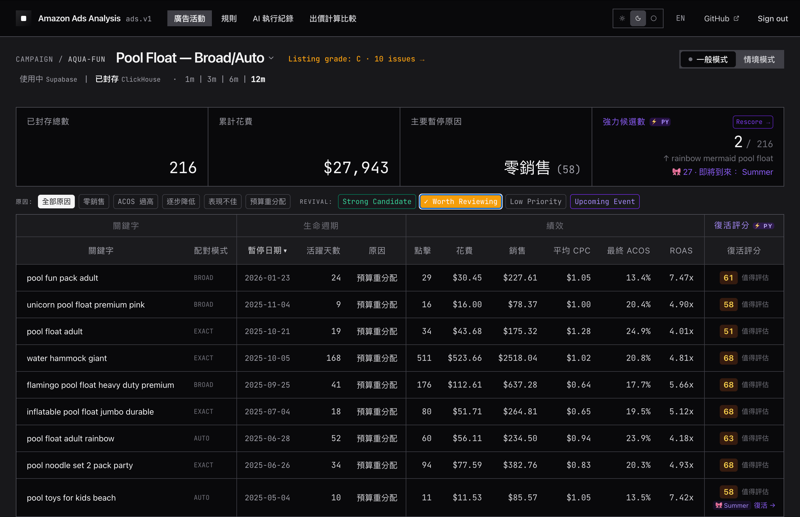

### Inactive Keywords — Scenario Mode (Upcoming Event Toggled)
The inactive keyword view with a macro event flag toggled on, showing how an upcoming event would factor into revive decisions.

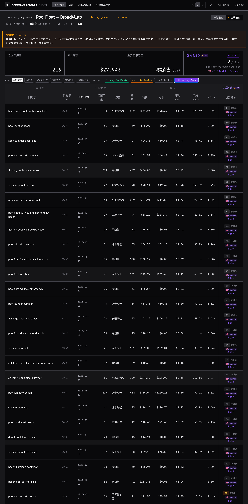

[↑ Back to top](#-tour-navigation)

---

## 📝 Section 5: AI Product Listing Analysis

A separate analysis flow for evaluating Amazon product listing copy — title, bullet points, description — against quality and campaign fit criteria. Unlike the keyword pipeline which runs two AI calls in sequence, the listing analysis fans out multiple AI calls in parallel (one per listing section), then aggregates the results into a single structured output. The same orchestration pattern and history logging used for keyword analysis applies here.

👁️ View Screenshots (4 images)

### Listing Evaluation Result (Sample 1)
Structured output from a listing analysis run — per-section scores, flagged issues, and improvement suggestions.

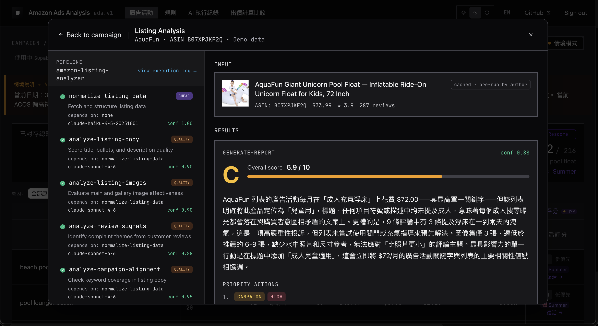

### Listing Evaluation Result (Sample 2)
A second listing result showing consistent structured output across different product types.

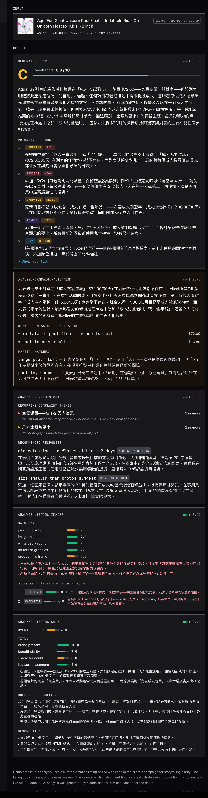

<!-- ### Fan-out Execution — Parallel AI Calls in Progress -->
<!-- TODO: add screenshot of the listing analysis mid-run showing multiple AI calls executing concurrently -->
<!-- placeholder: screenshot showing parallel call status panel during listing analysis -->
<!-- remove this section if screenshot is not available -->

<!-- ### Fan-out Execution — Aggregated Results -->
<!-- TODO: add screenshot showing how parallel call outputs are merged into the final structured listing report -->
<!-- placeholder: screenshot of the aggregated output panel post-run -->
<!-- remove this section if screenshot is not available -->

[↑ Back to top](#-tour-navigation)

---

## 🗂️ Section 6: AI Analysis History & Logs

Every analysis run — keyword or listing — is logged to Supabase with the full input/output payloads per AI call. This gives a complete audit trail: what was sent to the model, what came back, and how it rolled up into the final recommendation.

👁️ View Screenshots (4 images)

### Analysis History — Keyword Runs
Historical log of past keyword analysis runs. Each entry records the client, timestamp, mode (Normal / Scenario), and links to the full run detail.

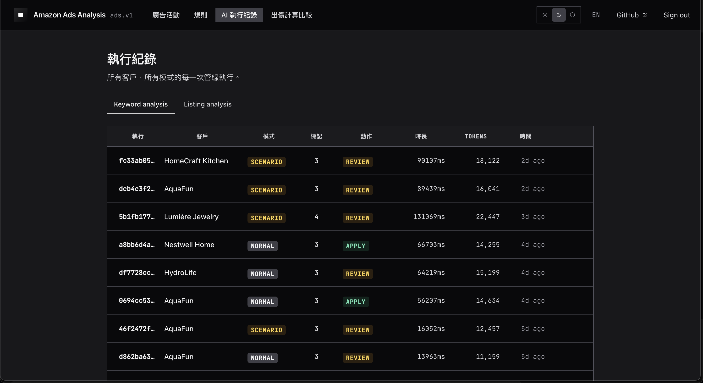

### Analysis History — Listing Runs
The same history log scoped to listing analysis runs, showing evaluation timestamps and result summaries.

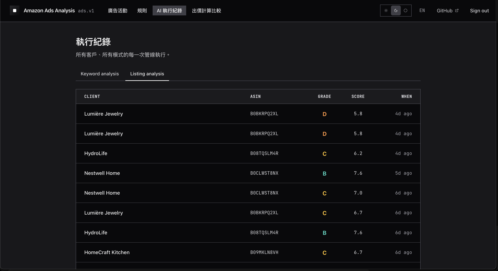

### Run Detail — Execution Trace
A historical run record showing the full per-call execution trace — per-keyword decisions, call outputs, and links to the parent campaign config.

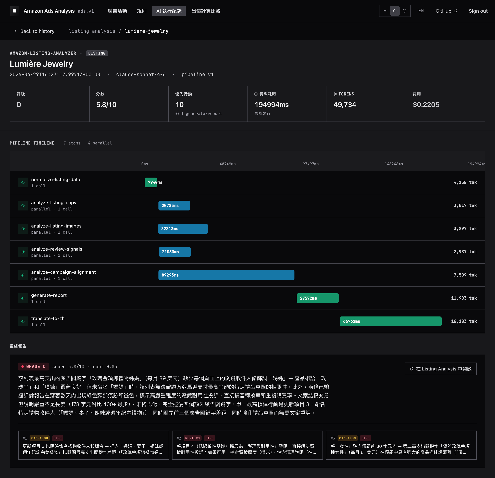

### Run Detail — Raw Input / Output Payloads
The exact JSON payloads sent to and received from each AI call during a historical run. Useful for debugging output drift and verifying schema contract compliance between calls.

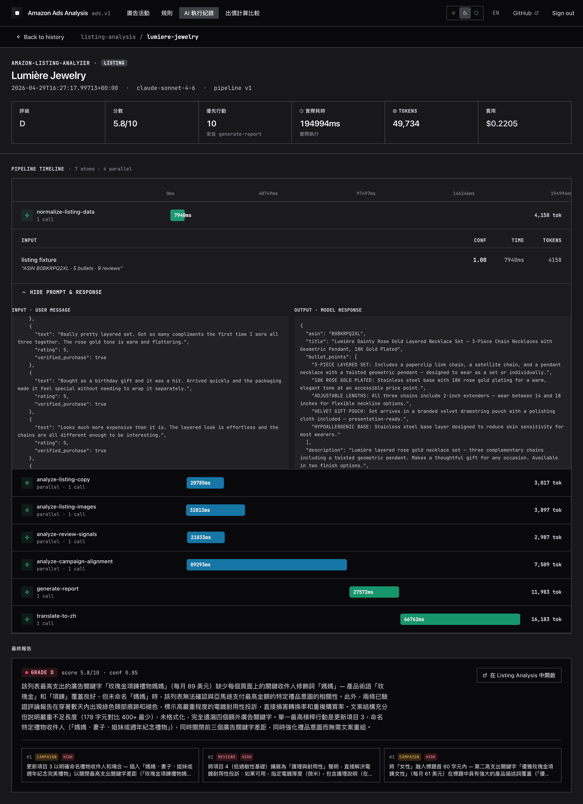

[↑ Back to top](#-tour-navigation)

---

## 🛠️ Section 7: Under the Hood — Rules Engine & Process Inspector

The Process Inspector exposes the internal configuration driving each analysis run: the system prompt templates injected at each atom boundary, the strict JSON schema contracts enforcing input/output shapes between atoms, and the pipeline step dependency graph. The Rules Inspector surfaces per-client ACOS tiers and rule priority order.

👁️ View Screenshots (5 images)

### Rules Engine — Client Configuration
The active rule set for a selected client: ACOS thresholds, rule priority order, and minimum click requirements. This drives all of Layer 1 with no AI involvement.

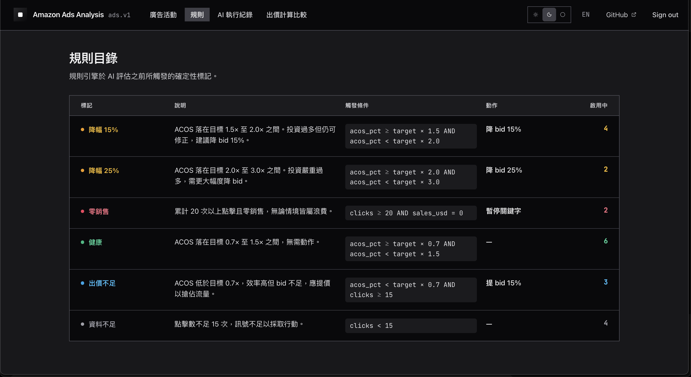

### Rule Detail — Individual Rule Inspector
Drilling into a single rule to review its exact condition logic and priority ranking.

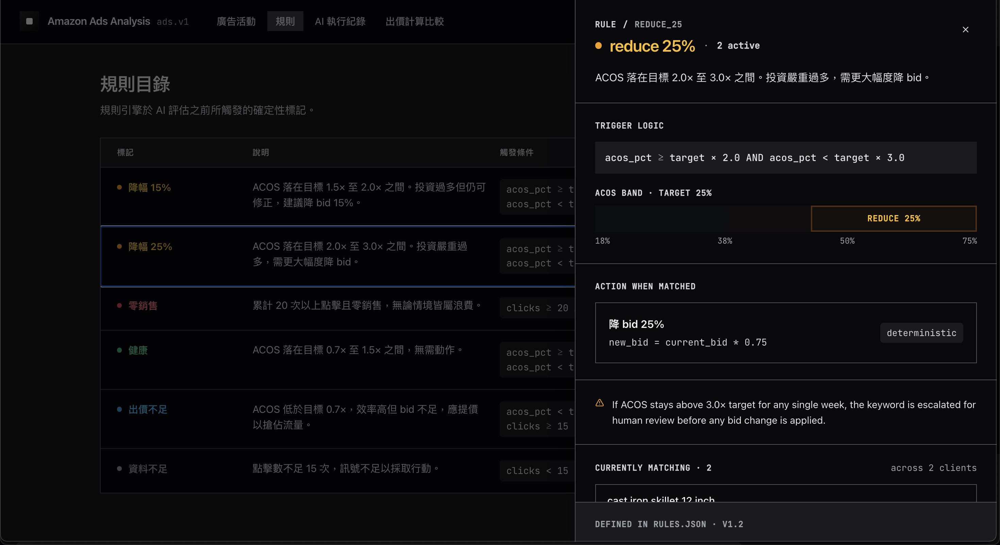

### Process Inspector — System Prompt Registry
The system prompt templates injected at each atom boundary, viewable per-client. These define exactly what context and instructions each AI call receives.

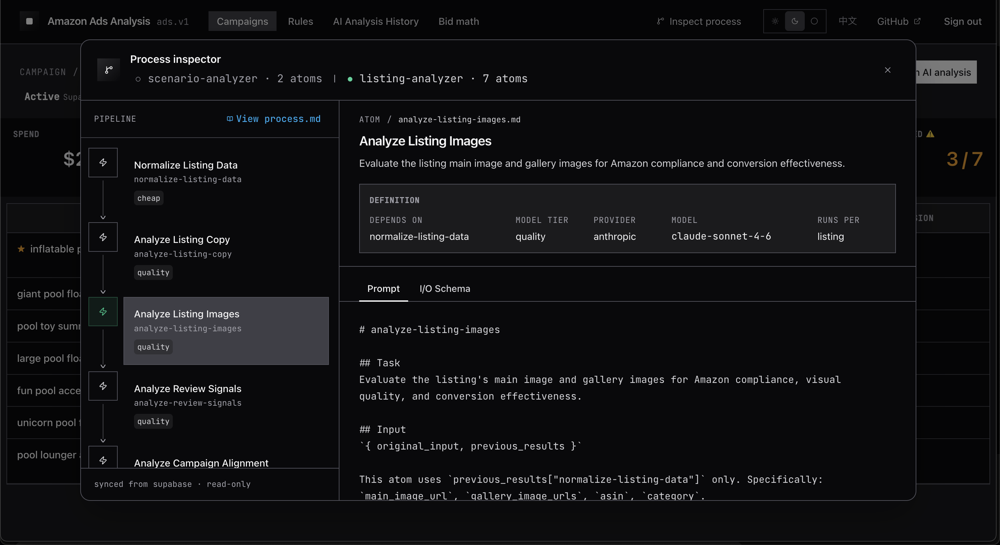

### Process Inspector — Input / Output Schema Contracts
The JSON schema definitions enforcing strict input and output shapes at each atom boundary — prevents output drift and error propagation between atoms.

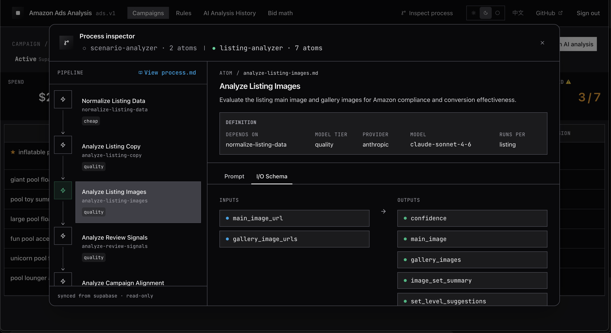

### Process Inspector — Pipeline Step Graph
The step dependency graph for a full analysis run, showing how Layer 1 (rules engine) feeds into Layer 2 (atom 1 → atom 2) and where results are persisted.

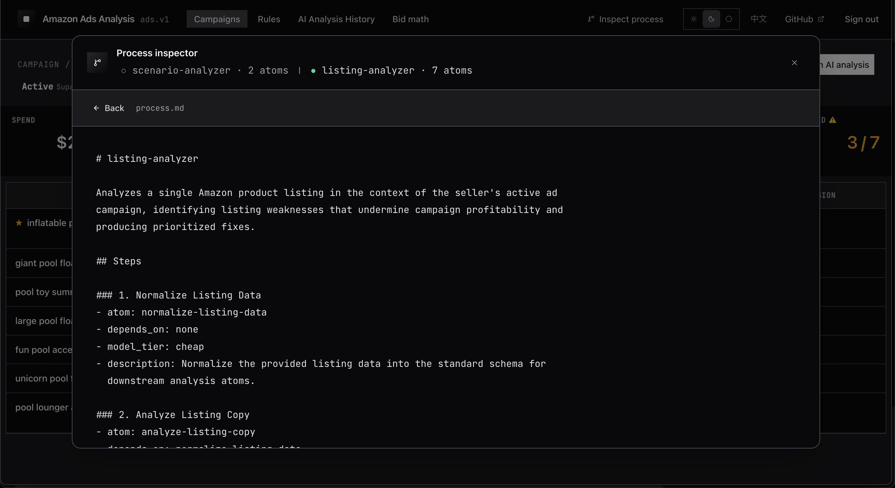

[↑ Back to top](#-tour-navigation)

---

← Back to [Portfolio README](../README.md)
