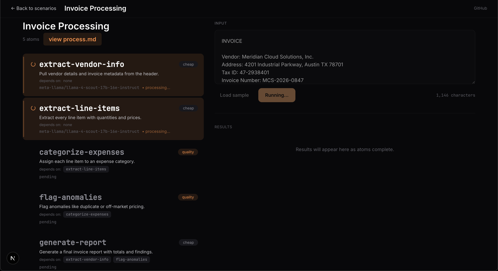
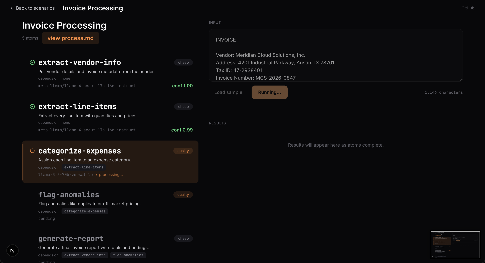
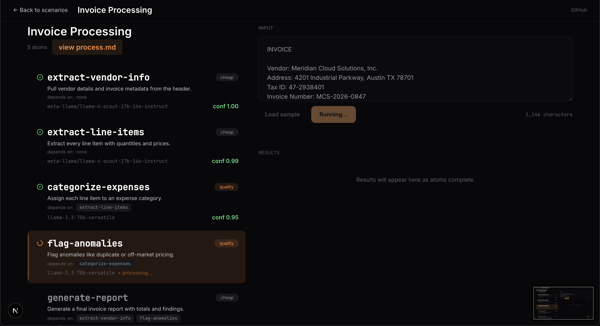
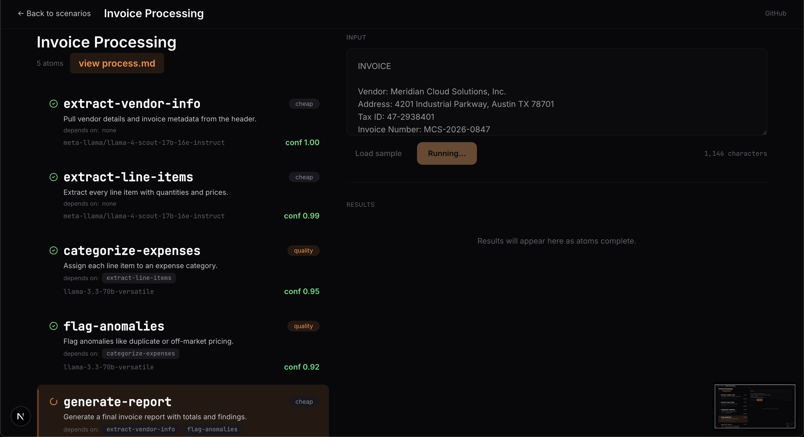
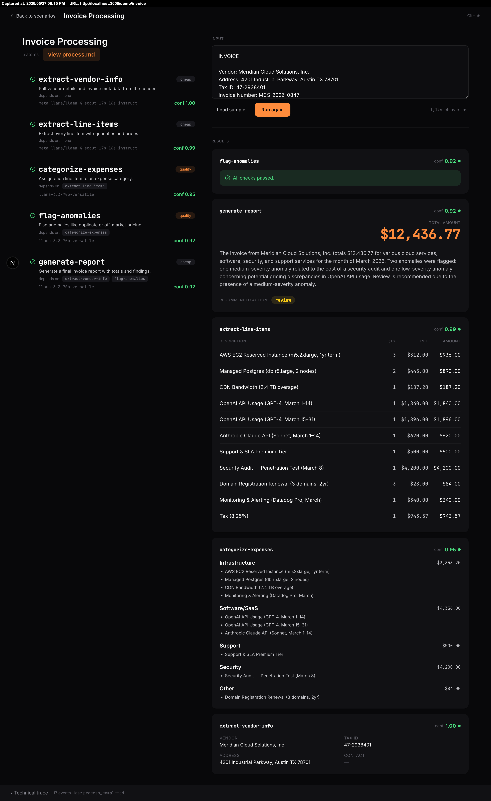
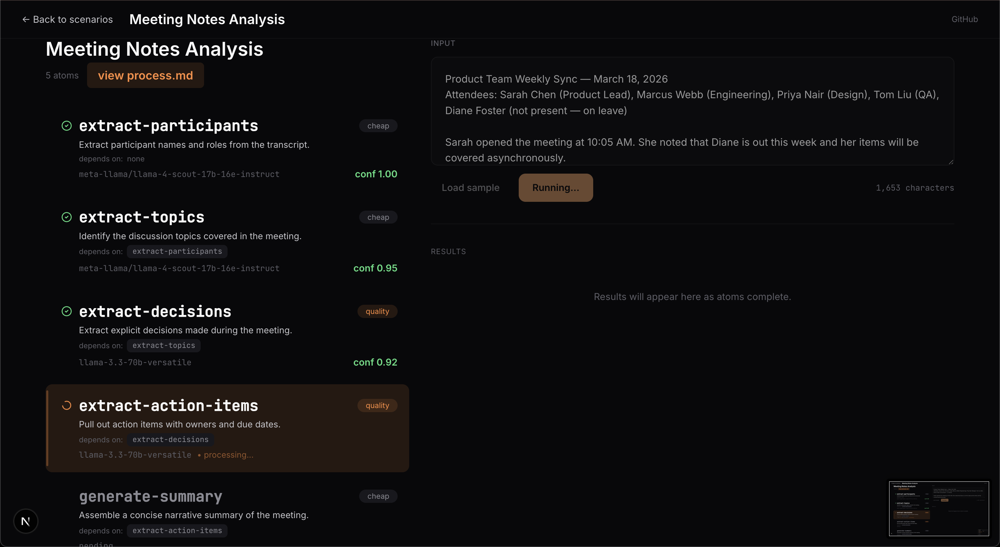
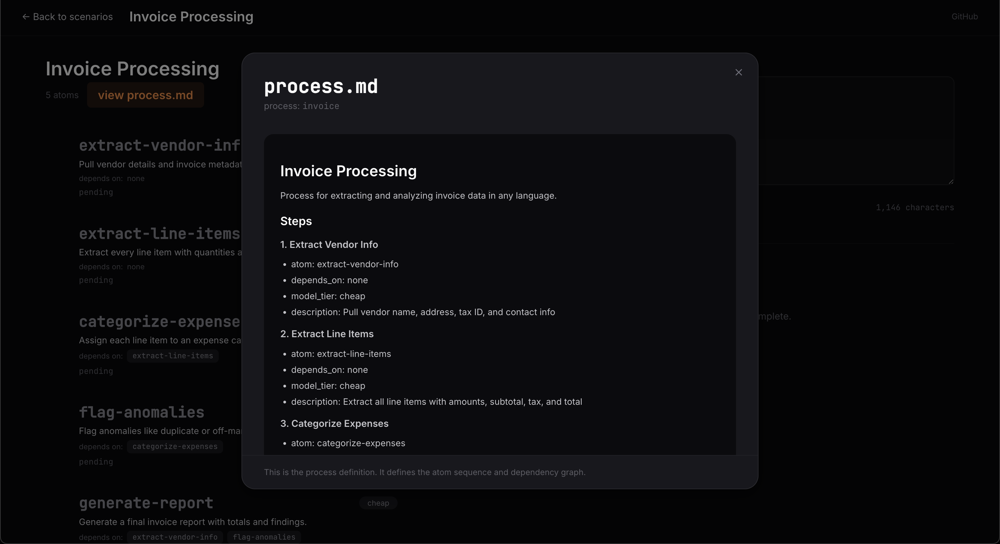

# Atom Process Engine

**A domain-agnostic AI pipeline engine where markdown files define processing logic and a thin infrastructure layer executes them. Same engine, swap the markdown, different pipeline.**

---

## What It Is

Most AI document-processing systems are expensive to maintain because they mix three things together in code: the pipeline mechanics (retry, validation, logging), the domain rules (what to extract, how to handle edge cases), and the AI calls themselves. Every new document type means new code. Every edge case means new parser logic. Every model change means a refactor.

The Atom Process Engine separates these cleanly into three layers. All intelligence lives in markdown files. The code is deliberately dumb plumbing — reads markdown, calls the LLM, validates output, passes to the next step. Adding a new domain means writing new markdown, not writing new code.

The demo runs two completely different pipelines — invoice processing and meeting notes analysis — on the same infrastructure. Paste an invoice, watch 5 steps execute. Paste meeting notes, watch a different 5 steps execute. Zero code changes between them. That's the claim, and the demo is the proof.

## Stack

TypeScript · Next.js (Vercel) · Supabase (Postgres + Realtime) · Anthropic API · OpenRouter

## Architecture

Three layers, strict separation, no leakage between them:

**Layer 1 — Infrastructure (hardcoded, domain-blind).** The orchestrator reads the dependency graph from the process markdown and runs steps in parallel where dependencies allow. Schema validation at every handoff. Retry up to 3 times per step. Confidence scoring — low score triggers escalation. Immutable audit log of every input and output. None of this layer knows anything about invoices or meeting notes.

**Layer 2 — Markdown Definitions (soft, editable, never compiled).** Each pipeline step is a single markdown file defining one narrow task — input contract, instructions, output schema, examples. Process files declare step sequences and dependencies per domain. Steps are reusable across domains: an "extract and normalize date" atom works for invoices, contracts, meeting notes, any document with a date. Over time the library accumulates; new pipelines are assembled from existing atoms rather than built from scratch. Non-developers can write and modify process definitions without touching code.

**Layer 3 — AI Execution (commodity, swappable).** One LLM call per step with narrow context. No step knows about other steps. Model routing per step — cheaper models for extraction, higher-quality models for reasoning. Provider routing — OpenRouter during dev, Anthropic for production. Switching providers is a config change.

## What's Technically Interesting

- **Parallel execution from a dependency graph, not a fixed pipeline shape.** Most pipeline systems execute steps in a fixed sequence baked into code. Here, the orchestrator computes the execution graph at runtime from the process markdown — steps with no unmet dependencies run concurrently, serialized only where real data dependencies exist. The invoice pipeline demonstrates this directly: two independent extraction atoms run in parallel before the sequential reasoning chain begins.

- **Schema validation at every step boundary prevents error compounding.** Each atom declares its output schema in its markdown. Output that doesn't conform is rejected before the next step sees it. Without this, one malformed extraction silently becomes a wrong categorization becomes a wrong report — the error multiplies invisibly. Validation at every boundary catches it at the source.

- **Confidence scoring + retry + escalation instead of silent failure.** Every step returns a confidence score alongside its output. Below threshold triggers retry with adjusted context. Persistent low confidence escalates to a human-review queue. The system knows when it doesn't know, rather than shipping a bad result quietly.

- **Model routing per step optimizes cost without sacrificing quality where it matters.** The process markdown tags each step as `cheap` or `quality`. Extraction steps run on faster, cheaper models. Reasoning steps — categorization, anomaly detection, decision extraction — run on higher-quality models. A runtime profile flag routes the entire pipeline to free OpenRouter models for dev or paid Anthropic models for production, with no code changes.

- **Elastic step granularity adapts to model capability.** Steps can be split or merged without touching infrastructure. When a stronger model ships, merge steps — fewer calls, lower cost, same output quality. When only a weaker model is available, split steps finer — more reliable under limited reasoning capacity. The architecture adapts to the model landscape rather than being locked to it.

- **Real-time trace panel makes the architecture visible.** Every step input, output, confidence score, retry, and validation event is logged to Supabase and streamed to the frontend via Realtime — color-coded by status, live as it happens. This isn't just an observability feature; it's what makes the demo legible. The trace is the architecture, made visible.

## Design Rationale

**Markdown as the soft layer, not code.** Configuration that lives in code requires a build and a deploy to change. Markdown is text — editable by product people, diffable in git, reviewable in PRs, deployable by a file save. For the flexibility to be real, it has to be softer than the mechanics. That's what markdown buys.

**Two domains in the demo, not one.** A single pipeline proves nothing about the architecture — any monolithic system could produce the same result. Running two unrelated domains on identical infrastructure is what proves domain-blindness. The second pipeline is the test of the architectural claim, not an extra feature.

**No framework.** No LangChain, no LlamaIndex. The core orchestrator is a few hundred lines of TypeScript. Every line is understood and controllable. Frameworks hardcode the granularity this architecture specifically keeps elastic — they would undermine the central design decision.

## Architecture Contribution

The three-layer model — dumb infrastructure, soft markdown definitions, commodity AI execution — emerged independently twice. First in NexusBrain, a config-driven chatbot engine I built earlier. Then again here for document processing, designed without referencing the prior system. That convergence is what made me trust it was load-bearing architecture rather than a clever one-off solution.

The same pattern is also running in production in the [Amazon Ads AI Optimization](https://github.com/ReeseChang/portfolio/blob/main/amazon-ads-optimization/README.md) project — same three-layer separation, same markdown-driven step definitions, same schema validation at each boundary, same audit logging. The engine was designed here as a standalone system first; the pattern was then carried into that project by copying the codebase directly rather than packaging it as a dependency, so both remain self-contained.

The architecture decisions are mine. Implementation was delegated to AI within documented constraints, using the same AI-directed development methodology I apply across projects.

## Roadmap

**Current:** Two-pipeline demo, dependency-graph orchestration, schema validation, retry/escalation, real-time trace, model routing, deployed on Vercel.

**Next — distributed execution (optional bolt-on):** Add a separate worker daemon that claims tasks atomically using Postgres `FOR UPDATE SKIP LOCKED`. Run two daemons simultaneously — both visible in the trace panel competing for tasks. This adds a distributed systems layer (concurrent workers, atomic task claiming, race conditions handled at the DB level) without touching the orchestrator or executor code at all. That's the point: the architecture absorbs it cleanly.

**Further:** Step library expansion (reusable atoms across domains), in-browser atom editor (edit markdown, rerun pipeline, see different result live), confidence-threshold tuning per step type.

## Links

Full codebase and session specs: private repo. Read access granted for hiring conversations — contact details in application / resume.

---

## Screenshots

### 1 — Landing Page

Two pipelines available from the scenario selector. Each card shows the domain, a short description, and the atom count. Selecting one loads the pipeline definition and input panel for that domain.

---

### 2 — Pipeline: Invoice Processing

The invoice pipeline has 5 atoms. The first two — `extract-vendor-info` and `extract-line-items` — have no dependencies and run in parallel immediately. The remaining three form a sequential reasoning chain: `categorize-expenses` waits on line items, `flag-anomalies` waits on categorization, and `generate-report` waits on both vendor info and anomaly flags. The dependency graph, not the code, determines the execution shape.

View Screenshots

**Steps 1 & 2 running in parallel** — `extract-vendor-info` and `extract-line-items` both fire immediately with no unmet dependencies. Both are cheap-model extraction tasks. This is the parallelism the dependency graph enables.

**Step 3 — `categorize-expenses` running** — both extraction steps complete (conf 1.00 and 0.99). The quality-model categorization step unlocks and starts. Schema validation confirmed both upstream outputs before passing them here.

**Step 4 — `flag-anomalies` running** — categorization completes (conf 0.95). Quality-model anomaly detection starts, consuming the categorized line items. Duplicate charges and off-market pricing are the targets.

**Step 5 — `generate-report` running** — anomaly flags complete (conf 0.92). The final cheap-model report step starts, pulling from both vendor info (step 1) and anomaly results (step 4) — a fan-in from two branches of the graph.

**Completed output** — All 5 atoms finished. Results: extracted vendor info, itemized line items, expenses categorized by type with subtotals, anomaly flags with severity, and a narrative summary with a recommended action.

---

### 3 — Pipeline: Meeting Notes Analysis

The meeting pipeline has 5 atoms in a strict sequential chain — each step depends entirely on the previous one's output. No parallelism. The dependency structure is different from the invoice pipeline, but the infrastructure executing it is identical. participants → topics → decisions → action items → summary.

View Screenshots

**Step 1 — `extract-participants` running** — no dependencies, cheap model, fires immediately.

**Step 2 — `extract-topics` running** — participants complete (conf 1.00). Topics extraction starts on cheap model; participant context is now available if needed.

**Step 3 — `extract-decisions` running** — topics complete (conf 0.95). Switches to quality model here — extracting decisions requires reasoning over topic context, not just pattern matching.

**Step 4 — `extract-action-items` running** — decisions complete (conf 0.92). Quality model continues; action items are derived from decisions, so the reasoning chain deepens.

**Step 5 — `generate-summary` running** — action items complete (conf 0.95). Back to cheap model for final aggregation — assembling a narrative from structured outputs is extraction, not reasoning.

**Completed output** — All 5 atoms finished. Results: participant roster with roles, topic summaries, decisions with owners, action items with assignees and due dates, and a narrative summary paragraph.

---

### 4 — Process and Atom Definitions

Every pipeline is fully inspectable in the UI. "View process.md" surfaces the process definition file — the dependency graph the orchestrator reads at runtime to compute execution order. Clicking any atom card opens its full markdown definition: task description, input contract, instructions, output schema. That file is the complete specification for a single LLM call. Edit the markdown, rerun the pipeline, get a different result — no code change, no deploy.

View Screenshots

**`categorize-expenses.md` — atom definition** — task description, input contract (line items from the prior atom as JSON), categorization instructions, allowed category list, and output schema. The process and model tier (quality) are shown in the header. This file is the entire specification for one LLM call.

**`process.md` — pipeline definition** — the full atom sequence with dependencies and model tiers for the invoice pipeline. This is what the orchestrator reads to compute the execution graph at runtime. No code encodes this structure.

