# Atom Process Engine

**A domain-agnostic AI pipeline engine where markdown files define processing logic and a thin infrastructure layer executes them. Same engine, swap the markdown, different pipeline.**

---

## What It Is

Most AI document-processing systems mix three things together in code: the pipeline mechanics (retry, validation, logging), the domain rules (what to extract, how to handle edge cases), and the AI calls themselves. That's why they're expensive to maintain — every new document type means new code, every edge case means new parser logic, every model change means a refactor.

The Atom Process Engine separates these cleanly into three layers. All intelligence lives in markdown files. The code is deliberately dumb plumbing — reads markdown, calls the LLM, validates output, passes to the next step. Adding a new domain means writing new markdown, not writing new code.

The demo runs two completely different pipelines — meeting notes analysis and invoice processing — on the same infrastructure. Paste meeting notes, watch 5 steps execute. Paste an invoice, watch a different 5 steps execute. Zero code changes between them.

## Stack

TypeScript · Next.js (Vercel) · Supabase (Postgres + Realtime) · Anthropic API · OpenRouter

## The Architectural Idea

Three layers, strict separation, no leakage:

**Layer 1 — Infrastructure (hardcoded, domain-blind).** The orchestrator reads the dependency graph from the process markdown and runs steps in parallel where dependencies allow. Schema validation at every handoff. Retry up to 3 times per step. Confidence scoring — low score triggers escalation. Immutable audit log of every input and output.

**Layer 2 — Markdown Definitions (soft, editable, never compiled).** Each pipeline step is a single markdown file describing one narrow task — input contract, instructions, output schema, good/bad examples. Process files sequence steps into pipelines per domain. Steps are reusable across domains: "extract date and normalize to ISO" works for invoices, contracts, meeting notes, any document with a date. Over time the library accumulates; new pipelines are assembled from existing steps rather than built from scratch. Non-developers can write new process definitions.

**Layer 3 — AI Execution (commodity, swappable).** One LLM call per step with narrow context. No step knows about other steps. Model routing per step — cheaper models for extraction, higher-quality models for reasoning and analysis. Provider routing — OpenRouter during dev, Anthropic for production.

## What's Technically Interesting

- **Dependency-graph orchestration with parallel execution.** Process markdown declares step dependencies. The orchestrator computes the execution graph at runtime and runs independent steps concurrently, serialized only where real dependencies exist. No fixed pipeline shape baked into code.

- **Schema validation at every step boundary.** Each step declares its output schema in its markdown. Output that doesn't conform is rejected before the next step sees it. This is how error compounding is prevented — one bad output can't silently propagate to become a wrong answer three steps later.

- **Confidence scoring + retry + escalation.** Every step returns a confidence score alongside its output. Below threshold triggers retry with adjusted context. Persistent low confidence escalates to a human-review queue rather than shipping a bad result silently.

- **Model routing per step.** The process markdown tags each step as `cheap` or `quality`. Extraction steps run on faster/cheaper models; reasoning steps run on higher-quality models. A runtime profile flag routes the same pipeline to free OpenRouter models for dev or paid Anthropic models for production.

- **Provider-agnostic LLM adapter.** One interface, multiple providers. Switching providers is a config change, not a code change.

- **Real-time trace panel.** Every step input, output, confidence, retry, and validation event is logged to Supabase. The frontend subscribes via Realtime and streams step execution as it happens — color-coded by status. The trace is the demo: watch the architecture work live.

## Design Rationale

- **Markdown as the soft layer, not code.** Compiled configuration lives in code and requires deploys to change. Markdown is text — editable by product people, diffable in git, reviewable in PRs, never requires a build step. The flexibility has to be *softer* than the mechanics for the architecture to pay off.

- **Two domains in the demo, not one.** Showing one pipeline proves nothing about the architecture — a monolithic system could do the same. Running two unrelated domains on the same infrastructure is what proves domain-blindness. The second pipeline is the test of the architectural claim.

- **Elastic step granularity.** Steps can be split or merged without infrastructure changes. When a better model ships, merge steps — fewer calls, lower cost, same output. When a worse model is all that's available, split steps finer — more reliable under weaker reasoning. The architecture adapts to model capability rather than fighting it.

- **No framework.** No LangChain, no LlamaIndex. The core orchestrator is a few hundred lines of TypeScript. Every line is understood and controllable. Frameworks hardcode the granularity this architecture specifically keeps elastic.

## Roadmap

- **Current:** Two-pipeline demo, dependency-graph orchestration, schema validation, retry/escalation, real-time trace, model routing, deployed on Vercel.
- **Next (optional bolt-on):** Separate daemon process with atomic task claiming (`FOR UPDATE SKIP LOCKED`), two daemons racing with both visible in the trace panel — adds distributed systems depth without touching orchestrator or executor code.
- **Further:** Step library expansion (reusable steps across domains), in-browser step editor (edit markdown, rerun pipeline, see different result live), confidence-threshold tuning per step type.

## How It Was Built

Solo build using AI-directed development. Architecture decisions are mine; implementation delegated to AI within documented constraints — the same methodology I use across my other projects.

The three-layer model emerged independently twice — once in another system I built (NexusBrain, a config-driven chatbot engine), then again here for document processing. That convergence is what made me trust it was load-bearing architecture, not a clever one-off.

## Related

The AI pipeline layer in the [Amazon Ads AI Optimization](../amazon-ads-optimization/README.md) project is built on the same architecture — same three-layer separation, same markdown-driven step definitions, same schema validation at each boundary, same audit logging pattern. The engine was designed here first as a standalone system, then the pattern was carried into that project. The codebase was copied directly rather than referenced as a package, so both are self-contained.

## Links

- Full codebase and session specs: private repo. Read access granted for hiring conversations — contact details in application / resume.

---

## Screenshots

### Scenario Selector — Landing Page
Two demo pipelines available from the landing page. Selecting a scenario loads the pipeline definition and input panel for that domain.

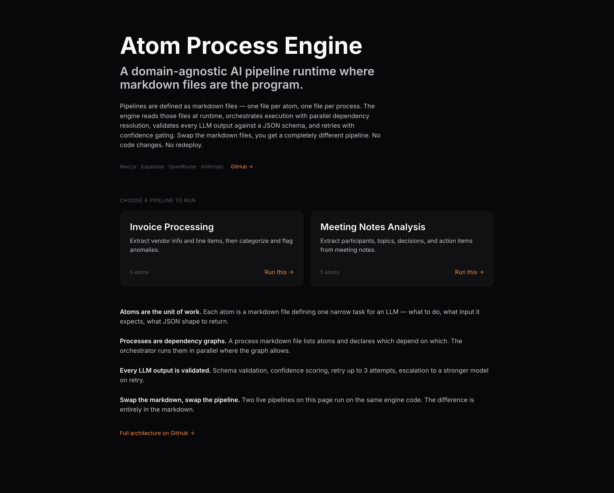

---

### Pipeline 1 — Invoice Processing

👁️ View Screenshots (6 images)

**Pipeline ready — all steps pending:**
All 5 steps listed with their dependencies and model tiers before the run starts.

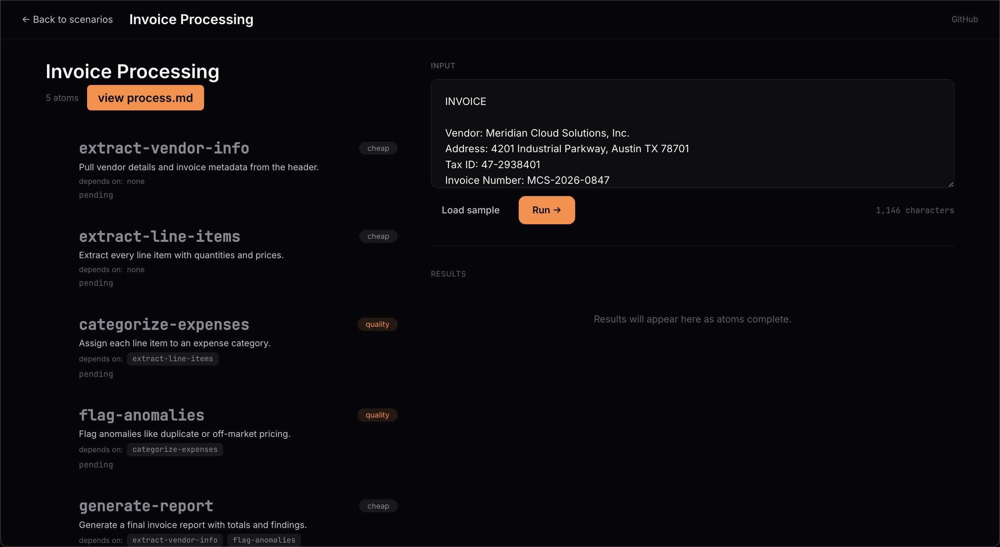

**Step 1 of 5 — `extract-vendor-info` running** (cheap model, no dependencies):
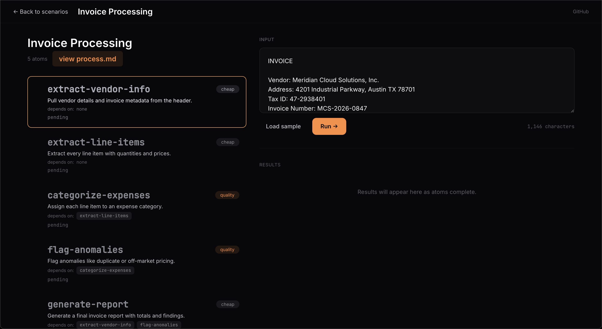

**process.md — Pipeline Definition**

The "view process.md" button surfaces the pipeline definition file directly in the UI. This is the markdown that drives the entire invoice pipeline — step names, dependencies, and model tier per step. No code, no deploy required to change it.

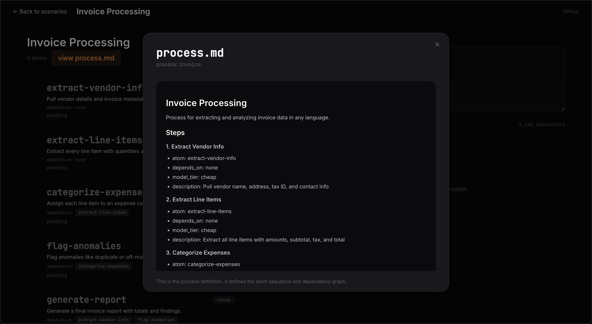

**Step Definition — `categorize-expenses`**

Clicking into any individual step shows its full markdown definition: the task description, input contract, instructions, and output schema. This is the complete specification for one LLM call — everything the model receives is defined here.

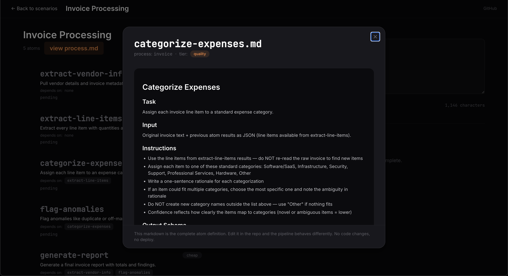

**process.md viewed from the UI:**

**Completed Output**

Five steps run in dependency order. The final output includes extracted vendor info, itemized line items, expense categorization by type, anomaly flags (duplicate charges, off-market pricing), and a generated summary report with a recommended action.

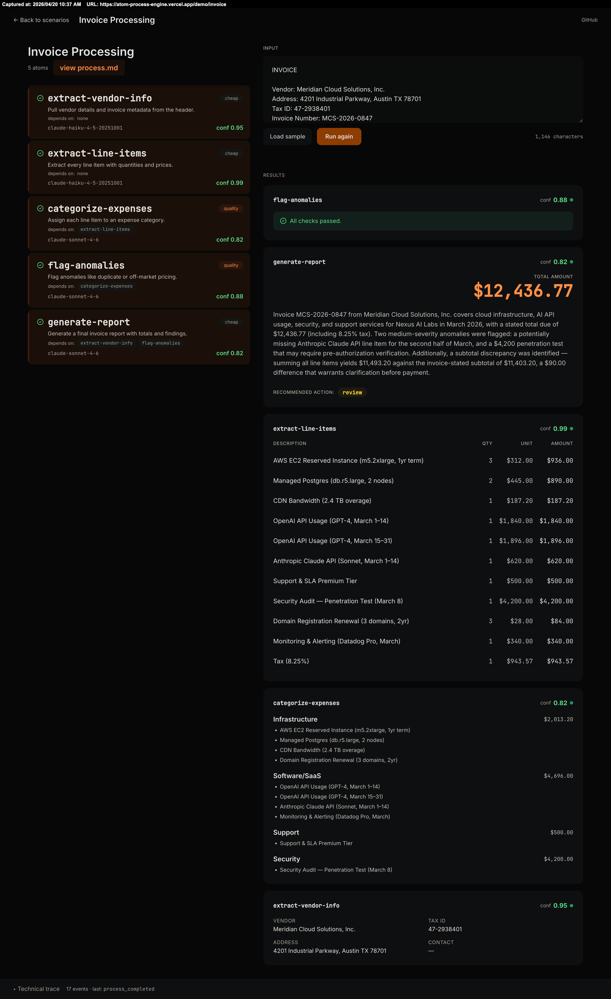

---

### Pipeline 2 — Meeting Notes Analysis

The left panel shows each step with its dependency, assigned model, and live status. Steps execute sequentially where dependencies require it — the highlighted card is the active step. Confidence scores appear as each step completes. The right panel streams results as they arrive, before the full run finishes.

👁️ View Screenshots (6 images)

**Step 1 of 5 — `extract-participants` running** (cheap model, no dependencies):
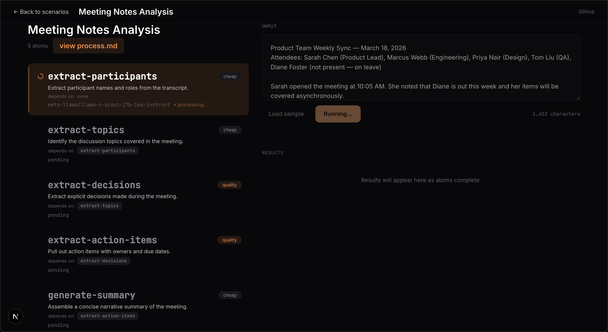

**Step 2 of 5 — `extract-topics` running** (`extract-participants` complete, conf 1.00):
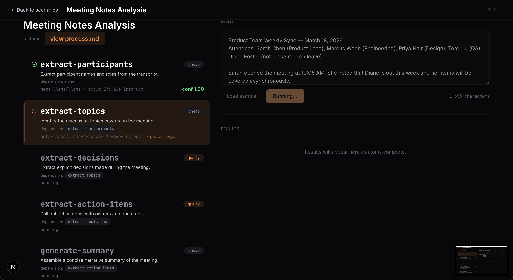

**Step 3 of 5 — `extract-decisions` running** (quality model, depends on topics, conf 0.95):
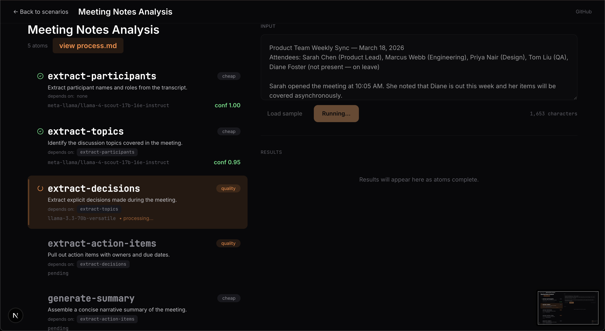

**Step 4 of 5 — `extract-action-items` running** (quality model, depends on decisions, conf 0.92):

**Step 5 of 5 — `generate-summary` running** (cheap model, final aggregation step):
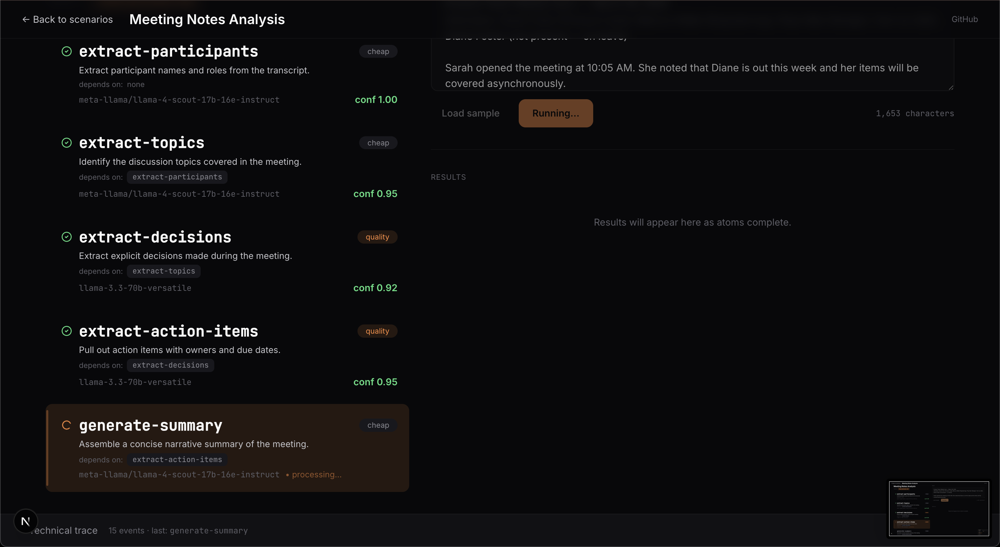

**Completed Output**

Participants, topics, decisions with owners, action items with assignees and due dates, and a narrative summary — all extracted from a raw meeting transcript in a single pipeline run.

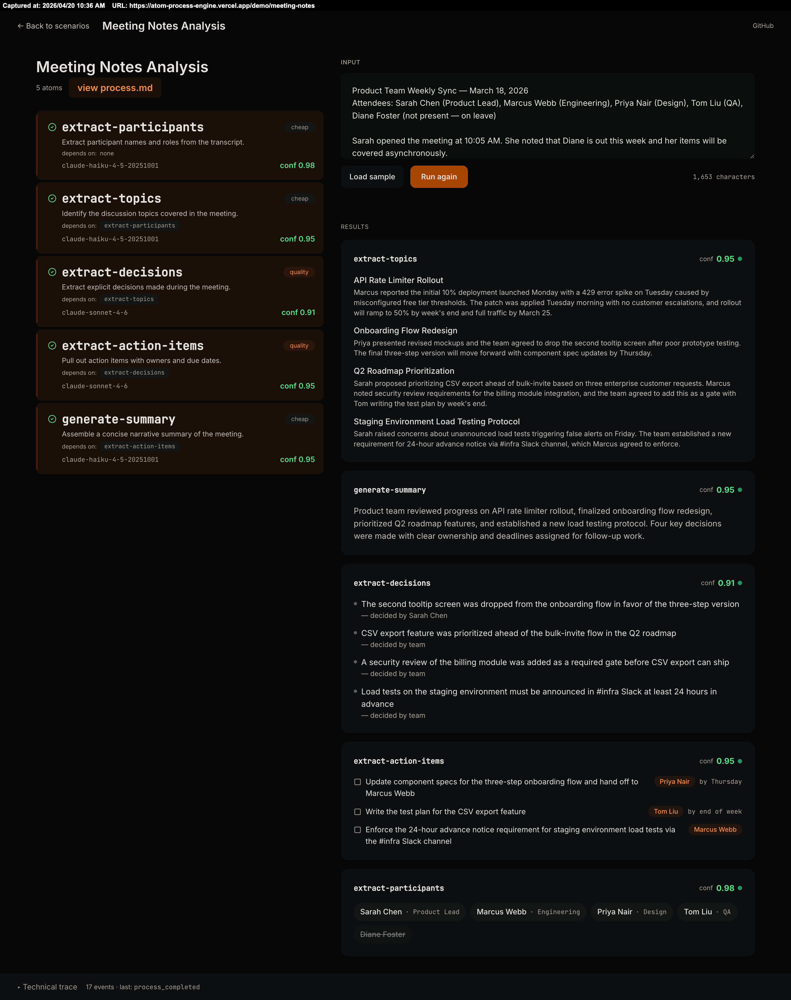

